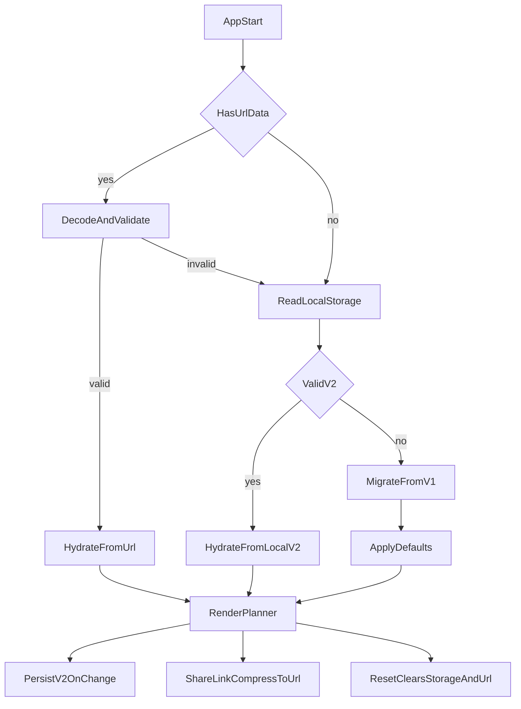

# ESN Calendar V2 Execution Plan

## Scope and Assumptions
- Implement all sections from [`/Users/omerahat/Desktop/esncalendar/docs/superpowers/specs/2026-04-29-esn-calendar-v2-design.md`](/Users/omerahat/Desktop/esncalendar/docs/superpowers/specs/2026-04-29-esn-calendar-v2-design.md).
- Use fixed categories: `Event Comm`, `SI Comm`, `Special Days`, `ESN Türkiye Events`.
- Assign distinct color tokens to each of the 4 categories and use them consistently in form controls and cards.
- Add optional per-event emoji/icon support (empty value allowed).
- Share URL state includes core data (events, members, ranges) plus view/UI state (current month/year and other agreed UI context).
- No backend; all persistence remains client-side.

## Phase 0: Baseline and Safety
- Inspect and document current state contract and storage key behavior in [`/Users/omerahat/Desktop/esncalendar/src/hooks/usePlannerState.ts`](/Users/omerahat/Desktop/esncalendar/src/hooks/usePlannerState.ts).
- Define a V2 persisted payload schema and migration rules from current V1 (`PlannerEvent[]`) in [`/Users/omerahat/Desktop/esncalendar/src/types.ts`](/Users/omerahat/Desktop/esncalendar/src/types.ts).
- Add runtime guards for storage and URL payload decoding to avoid app crashes on malformed data.

## Phase 1: Data Architecture and Sharing (Spec Section 1)
- Add URL-state encode/decode/compress helpers (lz-string) in a dedicated utility module under [`/Users/omerahat/Desktop/esncalendar/src/lib/`](/Users/omerahat/Desktop/esncalendar/src/lib/).
- Expand planner state shape in [`/Users/omerahat/Desktop/esncalendar/src/hooks/usePlannerState.ts`](/Users/omerahat/Desktop/esncalendar/src/hooks/usePlannerState.ts) to include:
  - events
  - members (with status/avatar metadata)
  - special date ranges
  - view/UI state selected for sharing
- Initialization priority:
  1. If `?data=` exists and decodes/validates, hydrate from URL.
  2. Else hydrate from localStorage V2.
  3. Else migrate V1 localStorage data.
  4. Else use defaults.
- Persist V2 payload to localStorage on state changes.
- Add header actions in [`/Users/omerahat/Desktop/esncalendar/src/App.tsx`](/Users/omerahat/Desktop/esncalendar/src/App.tsx):
  - `Share Link`: serialize + compress + write to URL and copy/share behavior.
  - `Reset Calendar`: confirmation, clear localStorage, reset in-memory state, remove URL `data` param.

## Phase 2: Event Management Updates (Spec Section 2)
- Remove `time` field from event model in [`/Users/omerahat/Desktop/esncalendar/src/types.ts`](/Users/omerahat/Desktop/esncalendar/src/types.ts), seed data in [`/Users/omerahat/Desktop/esncalendar/src/data/initialData.ts`](/Users/omerahat/Desktop/esncalendar/src/data/initialData.ts), and all usages.
- Add event category model with fixed values and distinct colors:
  - `Event Comm`
  - `SI Comm`
  - `Special Days`
  - `ESN Türkiye Events`
- Add optional event icon model (`emojiOrIcon?: string`) so events can have no icon or a selected emoji/icon.
- Keep category metadata as source of truth in [`/Users/omerahat/Desktop/esncalendar/src/types.ts`](/Users/omerahat/Desktop/esncalendar/src/types.ts) + config utility.
- Update modal form in [`/Users/omerahat/Desktop/esncalendar/src/components/EventModal.tsx`](/Users/omerahat/Desktop/esncalendar/src/components/EventModal.tsx):
  - remove time input
  - add category selector
  - add optional emoji/icon input or picker (can be left blank)
  - add delete action for existing event
- Extend state actions in [`/Users/omerahat/Desktop/esncalendar/src/hooks/usePlannerState.ts`](/Users/omerahat/Desktop/esncalendar/src/hooks/usePlannerState.ts) with robust `deleteEvent`.
- Update card rendering in [`/Users/omerahat/Desktop/esncalendar/src/components/EventCard.tsx`](/Users/omerahat/Desktop/esncalendar/src/components/EventCard.tsx) to:
  - prepend optional event emoji/icon when provided
  - apply category color styling for all 4 fixed categories.

## Phase 3: Special Date Ranges (Spec Section 3)
- Introduce `SpecialDateRange` type (id, startDate, endDate, description, color) in [`/Users/omerahat/Desktop/esncalendar/src/types.ts`](/Users/omerahat/Desktop/esncalendar/src/types.ts).
- Add CRUD state actions for ranges in [`/Users/omerahat/Desktop/esncalendar/src/hooks/usePlannerState.ts`](/Users/omerahat/Desktop/esncalendar/src/hooks/usePlannerState.ts).
- Add new range form below calendar in [`/Users/omerahat/Desktop/esncalendar/src/App.tsx`](/Users/omerahat/Desktop/esncalendar/src/App.tsx) with validation (inclusive range, required description, valid color).
- Extend calendar rendering in [`/Users/omerahat/Desktop/esncalendar/src/components/CalendarGrid.tsx`](/Users/omerahat/Desktop/esncalendar/src/components/CalendarGrid.tsx) and supporting date helpers in [`/Users/omerahat/Desktop/esncalendar/src/lib/calendar.ts`](/Users/omerahat/Desktop/esncalendar/src/lib/calendar.ts) to display horizontal multi-day bars across covered cells.
- Ensure range overlays do not break event drag-and-drop interactions.

## Phase 4: Member Profiles and Statuses (Spec Section 4)
- Extend `Member` type with `status` in [`/Users/omerahat/Desktop/esncalendar/src/types.ts`](/Users/omerahat/Desktop/esncalendar/src/types.ts).
- Add role enum/union for:
  - Yönetim Kurulu
  - Denetim Kurulu
  - YK Destek
  - Üye
  - Aday Üye
- Update member seeds in [`/Users/omerahat/Desktop/esncalendar/src/data/initialData.ts`](/Users/omerahat/Desktop/esncalendar/src/data/initialData.ts) with status.
- Add avatar URL resolver utility (kebab-case name mapping + `.jpg`/`.png` fallback + `default.png`) in [`/Users/omerahat/Desktop/esncalendar/src/lib/`](/Users/omerahat/Desktop/esncalendar/src/lib/).
- Update sidebar rendering in [`/Users/omerahat/Desktop/esncalendar/src/components/MembersPanel.tsx`](/Users/omerahat/Desktop/esncalendar/src/components/MembersPanel.tsx):
  - circular image avatars (`rounded-full`)
  - status line under member name
  - resilient image `onError` fallback behavior.

## Phase 5: Branding, Typography, and Color System (Spec Section 5)
- Add ESN logo to top-left header in [`/Users/omerahat/Desktop/esncalendar/src/App.tsx`](/Users/omerahat/Desktop/esncalendar/src/App.tsx) and ensure export-safe loading.
- Replace current font setup in [`/Users/omerahat/Desktop/esncalendar/index.html`](/Users/omerahat/Desktop/esncalendar/index.html) and [`/Users/omerahat/Desktop/esncalendar/src/index.css`](/Users/omerahat/Desktop/esncalendar/src/index.css):
  - heading font: Kelson Sans
  - body font: Lato
- Because project appears Tailwind v4-style, define brand tokens in CSS theme layer and refactor hardcoded colors in:
  - [`/Users/omerahat/Desktop/esncalendar/src/App.tsx`](/Users/omerahat/Desktop/esncalendar/src/App.tsx)
  - [`/Users/omerahat/Desktop/esncalendar/src/components/EventModal.tsx`](/Users/omerahat/Desktop/esncalendar/src/components/EventModal.tsx)
  - [`/Users/omerahat/Desktop/esncalendar/src/components/EventCard.tsx`](/Users/omerahat/Desktop/esncalendar/src/components/EventCard.tsx)
  - [`/Users/omerahat/Desktop/esncalendar/src/components/MembersPanel.tsx`](/Users/omerahat/Desktop/esncalendar/src/components/MembersPanel.tsx)
  - [`/Users/omerahat/Desktop/esncalendar/src/components/CalendarGrid.tsx`](/Users/omerahat/Desktop/esncalendar/src/components/CalendarGrid.tsx)

## Phase 6: PNG Export Reliability (Spec Bug Fix)
- Harden export flow in [`/Users/omerahat/Desktop/esncalendar/src/lib/export.ts`](/Users/omerahat/Desktop/esncalendar/src/lib/export.ts):
  - await font readiness before capture
  - capture correct target scope (define whether left pane only or whole planner container)
  - add defensive options for image-heavy capture (`useCORS`, logging/error handling)
  - keep consistent background/color rendering with new theme
- Verify exported output includes logo, typography, avatars, event emoji/category styles, and date-range bars.

## Phase 7: Integration, Verification, and Stabilization
- Verify create/edit/delete event lifecycle, drag behavior, member assignment, and range rendering edge cases (month boundaries, single-day range, overlapping ranges).
- Verify URL share roundtrip: generate link, open in clean session, hydrate correctly, override local data, then reset cleanly.
- Verify migration path for existing users with old localStorage payload.
- Run lint/build/tests and fix regressions.

## Implementation Flow Diagram

## Sequencing Recommendation
- Implement in this order to minimize regressions:
  1. schema + migration + URL serialization
  2. event model/category/delete
  3. date range model + rendering
  4. member status/avatar
  5. branding pass
  6. export hardening
  7. end-to-end verification