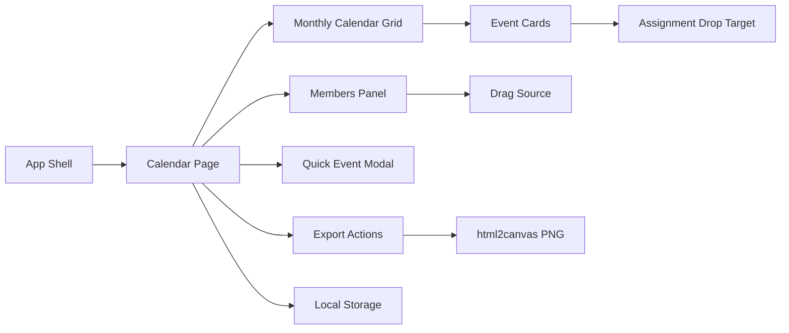

# ESN Event Planner Website Build Plan

## Context

The current workspace is documentation-only, so implementation should begin by scaffolding a new frontend app rather than modifying an existing codebase. The key inputs are:

- [`PRD.md`](/Users/omerahat/Desktop/esncalendar/PRD.md): MVP source of truth for a simple frontend-only PoC with monthly calendar, quick event creation, member drag-and-drop, and PNG/JPEG export.
- [`pages/esn_event_planner_project_brief.md`](/Users/omerahat/Desktop/esncalendar/pages/esn_event_planner_project_brief.md): broader product direction including special days, member management, event panel, and additional export formats.
- [`pages/unity_exchange/DESIGN.md`](/Users/omerahat/Desktop/esncalendar/pages/unity_exchange/DESIGN.md): visual system for colors, typography, spacing, cards, buttons, and dashboard layout.
- [`GEMINI.md`](/Users/omerahat/Desktop/esncalendar/GEMINI.md): implementation mandates: React, Tailwind CSS, `lucide-react`, `@dnd-kit/core` or native drag/drop, `html2canvas`, local state only.

## Recommended Scope

Build the site in two layers:

- **Phase 1: PoC MVP**: match `PRD.md` exactly: monthly calendar, quick event modal, member pool, drag/drop assignments, local state persistence, PNG export.
- **Phase 2: Product polish**: add items from the `pages` brief that expand the product but are not required for the core demo: special days sidebar, location field, export dropdown, `.ics` export, Google Sheets export placeholder or CSV fallback.

This keeps the first build small enough to complete quickly while leaving clean extension points for the richer dashboard vision.

## Target Architecture



## Tech Stack

- Scaffold with **Vite + React + TypeScript** for a lightweight frontend PoC.
- Use **Tailwind CSS** for the Unity & Exchange styling system.
- Use **`lucide-react`** for icons such as calendar, download, users, plus, clock.
- Use **`@dnd-kit/core`** for member-to-event drag/drop because it is maintained and works well with React state.
- Use **`html2canvas`** for exporting the calendar region as PNG.
- Use **React local state plus `localStorage`**. Avoid a backend, auth, database, and complex roles for the MVP.

## App Structure

Create a compact structure that can grow without overengineering:

- `src/App.tsx`: app shell and top-level page composition.
- `src/components/CalendarGrid.tsx`: month grid, day cells, event rendering.
- `src/components/EventCard.tsx`: event details and assigned member avatars.
- `src/components/MembersPanel.tsx`: draggable member list.
- `src/components/EventModal.tsx`: quick add/edit form for title, date, and time.
- `src/components/ExportButton.tsx`: `html2canvas` capture and download flow.
- `src/data/initialData.ts`: mock members and starting events from the PRD.
- `src/hooks/usePlannerState.ts`: events, members, assignment actions, localStorage persistence.
- `src/lib/calendar.ts`: month/day helpers.
- `src/lib/export.ts`: image export helper.
- `src/styles` or Tailwind config: brand colors and typography tokens from `DESIGN.md`.

## Data Model

Start with the PRD shape, but normalize date handling for easier calendar logic:

```ts
type Member = {
  id: string;
  name: string;
  color: string;
};

type PlannerEvent = {
  id: string;
  title: string;
  date: string; // YYYY-MM-DD
  time: string; // HH:mm
  assignedMemberIds: string[];
};
```

Use mock data matching the documents:

- Ömer: `#ec008c`
- Ayşe: `#7ac143`
- Ali: `#f47c36`
- Welcome Party on the demo month at `21:00`, assigned to Ömer and Ayşe.

## UX Plan

The first screen should immediately show the planner without login:

- Top header with ESN Event Planner title, current month controls, and `Takvimi İndir` button.
- Main content area with a large monthly calendar grid.
- Right sidebar with `Members`, draggable member cards, and a short hint explaining drag/drop.
- Click a day to open a minimal event modal asking for `Event Name` and `Time`.
- Drop a member onto an event card to assign them.
- Assigned members render as colorful avatar initials on the event card.
- Avoid venue, description, role management, and auth in Phase 1.

## Visual Design Plan

Translate `pages/unity_exchange/DESIGN.md` into Tailwind theme tokens:

- Primary actions: ESN Cyan `#00aeef` / design primary container.
- Accent avatars/chips: Magenta `#ec008c`, Green `#7ac143`, Orange `#f47c36`.
- Background: white or very light surface `#fcf8ff` / `#f8f9fa`.
- Text: deep blue `#04006d` for high contrast.
- Font: Plus Jakarta Sans via Google Fonts, with system fallback.
- Cards: white background, 1px neutral border, `rounded-2xl`, soft low-opacity shadow.
- Layout: desktop dashboard with calendar left and members right; mobile stacks panels vertically.

## Implementation Steps

1. Scaffold the frontend app in the workspace with Vite React TypeScript.
2. Install dependencies: Tailwind CSS, `lucide-react`, `@dnd-kit/core`, `html2canvas`.
3. Configure Tailwind with Unity & Exchange colors, font family, border radius, and basic global styles.
4. Build the planner state hook with initial mock data, event creation, assignment, unassignment if needed, and `localStorage` persistence.
5. Build calendar helpers for the current month grid, including leading/trailing blank days and ISO date keys.
6. Build the dashboard layout: header, calendar region, members sidebar, responsive behavior.
7. Build quick event creation via a modal opened from day-cell clicks.
8. Add drag/drop: members are draggable, event cards are droppable, and dropping assigns the member id to the event.
9. Build event card display with title, time, and assigned member initials/colors.
10. Add PNG export by capturing only the calendar container, not the entire app chrome/sidebar.
11. Add small UX polish: empty states, duplicate-assignment prevention, hover/focus states, accessible labels.
12. Verify with a browser run, test event creation, drag/drop assignment, reload persistence, and PNG download.

## Phase 2 Extensions

After the MVP is stable, extend toward the broader `pages` brief:

- Add a `SpecialDaysPanel` for selected-month holidays and cultural dates.
- Expand event creation into a slide-over panel with optional location and assigned members.
- Add export dropdown with PNG now, `.ics` next, and CSV/Google Sheets-compatible export later.
- Add month navigation and seed examples for a more realistic ESN planning demo.
- Add event editing/deletion if the demo needs live presentation flexibility.

## Testing Checklist

- App loads without backend/auth.
- Calendar renders the correct month grid.
- Clicking a day creates an event with title and time.
- Member cards can be dragged onto event cards.
- Duplicate member assignments are ignored.
- Assigned members display visibly in exported image.
- Reloading the page preserves events and assignments via `localStorage`.
- `Takvimi İndir` downloads a readable PNG of the calendar.
- Layout remains usable on desktop and common mobile widths.